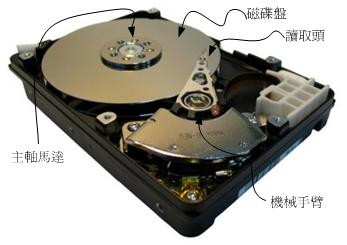
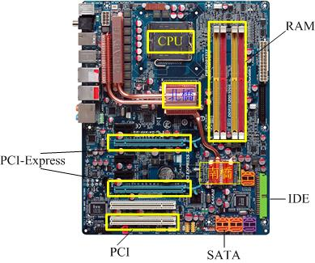
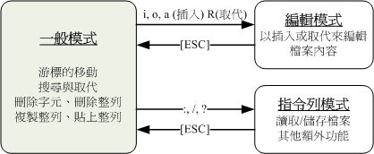

title: Linux学习环境搭建
date: 2016-05-15 10:56:35
tags: Linux
category: Linux
author: 张雷刚
---

## 需要准备的软件包
>1.	虚拟机软件VMware Workstation
    win7系统推荐8.0版本，注意该软件并不是免费的。
    * 这里分享一个自己翻墙下的[VMware Workstation 8.0.3](http://pan.baidu.com/s/1i5xvYx3)
    * 需要输入的licence[0U6UU-6AJDL-RZTK9-230Q0-8ARJQ](http://www.56ads.com/article/1440.html)
>2.	linux系统镜像文件<!-- more -->
	可以到[mirror.163.com](http://mirrors.163.com/)去下载，速度会比较快，最好用迅雷下载。

## 安装虚拟机
重要的是对虚拟机网络配置的概念了解，还有虚拟机内存大小建议设置为1024MB，绝大部分安装过程为点击下一步。
* __桥接__ 可以简单理解为通过物理主机真实网卡连入实际的网络中。因此，虚拟机可以分配与物理主机相同网段的独立IP，所有网络功能和网络中的真实机器几乎完全一样。
* __NAT__ 虚拟机通过VMnet8虚拟网卡与外界通信。
* __Host-only__ 虚拟机通过VMnet1虚拟网卡与外界通信。与NAT的不同就是不能连internet网

## 安装CentOS 6.X操作系统
### 背景知识-硬盘与存储设备
   1. 硬盘的物理组成  硬盘其实是由许多的盘片、机械手臂、磁头与主轴马达所组成的。如下图所示：
   
   2. 盘片上的数据  
     __扇区Sector:__ 整个盘片上面好像有多个同心圆绘制出的饼图，而由圆心以放射状的方式分割出磁盘的最小存储单位，那就是扇区，在物理组成方面，每个扇区大小为512bytes，这个值是不会改变的。
     __磁道Track:__ 扇区组成一个圆就成为磁道。
     __柱面Cylinder:__ 多个盘片时，在所有盘片上面的同一个磁道可以组成一个柱面，柱面也是我们分割硬盘时的最小单位了。
   
   3. 计算整个硬盘的存储量时，计算公式就是：
   header磁头数量x每个header负责的柱面数量x每个柱面所含有的扇区数量x扇区容量
   4. 传输接口，硬盘与主机系统的连接主要有IDE接口和SATA接口
     __IDE接口:__  IDE介面插槽所使用的排线较宽，每条排线上面可以接两个IDE装置，由於可以接两个装置，那为了判别两个装置的主/从架构， 因此这种磁碟机上面需要调整跳针(Jump)成为Master或slave才行！
     __SATA接口:__ 由於SATA一条排线仅接一颗硬盘，所以你不需要调整跳针。不过一张主机板上面SATA插槽的数量并不是固定的， 且每个插槽都有编号，在连接SATA硬盘与主机板的时候，还是需要留意一下。
    

### 磁盘分区表 partition table
  1. 磁盘的第一个扇区记录了两个重要的信息，包括MBR主引导分区（大小为446bytes）和分区表(64bytes)。
  2. 分区表的大小决定了只能写入四组分区信息，而分区就是对该表进行设置而已。
  3. 分区信息记录的是该区段的启始与结束的柱面号码。
  4. 能够使用额外的扇区来记录分区信息。
      >* 扩展分区Extented partition只能有一个。扩展分区加上主分区Primary partition最多可以有四个，这是硬盘的限制。
      >* 能够被格式化后作为数据访问的分区为主分区与逻辑分区。扩展分区无法格式化。
      >* 格式化的含义其实还可以进一步追究。大概意思就是格式化主要目的不是删除数据，而是创建文件系统。

### 为什么要分区？
  1. 数据的安全性。比如你在windows下重装系统，只有C盘的数据被重置了，而对其它D盘等的数据不会影响。
  2. 系统的性能考虑。分区对数据进行集中分类，每次系统操作数据的时候，指定分区后，那么会把范围缩小到该分区对应的起始柱面范围。
  

### 挂载
问题：整个Linux系统使用的是目录树结构，但是我们的文件数据其实是放置在磁盘分区当中的。那么两者怎么联系结合起来的呢？
__挂载__就是利用目录当作分区的进入点，将磁盘分区的数据放置在该目录下。也就是说进入该目录就可以读取该分区的意思。
   下图表示__partition 1挂载到根目录__，__partition 2挂载到/home这个目录__
   
   

### 磁盘分区
在安装过程中会提示你进行哪种类型的安装，我们选择Create Custom Layout自定义分区方式
  1. 创建第一个分区，/boot分区，为了保证该分区在整块硬盘的最前面部分，需要勾选强制为主分区。大小一般为200MB
  2. 创建swap交换分区。大小一般为1024MB
  3. 创建/(根)分区。大小为余下的所有空间，当然你也可以自定义大小，为磁盘留一点空间备用。
  分区完成后还会有系统安装包组的选择与配置过程，在这里的选项会决定你系统默认安装哪些包，支持哪些命令。最开始选的最小化安装，发现居然没有基本的setup和man命令。

### 安装之后的一些常用命令
  >1. 重要的热键
    * [Tab]按键 接在一串命令的第一个命令的后面，为“命令补全”，接在一串命令的第二个命令以后时，则为“文件补全”
    * [Ctrl]-c按键 中断目前程序
    * [Ctrl]-d按键 相当于输入exit
    * [Ctrl]-l按键或者clear命令 相当于清屏
  >2. man相关
    * 输入"/",光标会移动到屏幕的最下面一行，并等待你输入查找的字符串了
    * 直接按下q离开

## 安装SecureCRT远程管理Linux系统
>1. SecureCRT配置
    在Session Options菜单下，调整字体和编码集在Appearance选项卡下主要解决中文显示乱码等问题，还可以调整界面颜色use color scheme。
>2. 配置Linux系统IP地址
    * 通过setup命令配置修改网卡的配置文件，配置完成后还需执行ifup eth0启动网卡，然后通过ifconfig eth0命令查看
    * 通过ifconfig eth0 xxx.xxx.xxx.x配置只是临时生效
    * 在Host-only和NAT模式下，虚拟机的ip配置需要与虚拟网卡的VMnet1或者VMnet8的IP网段保持一致
    验证：配置完成后可以在windows端的命令窗口ping一下虚拟机ip看是否成功，成功后就能通过SecureCRT端远程管理Linux系统了。
>3. 让Linux网卡开机自动启动
    
    vim /etc/sysconfig/network-scripts/ifcfg-eth0
    设置ONBOOT=yes
    

## vim程序编辑器
>1. vi基本上分为3种模式，分别是一般模式、编辑模式与命令行模式。
vi三种模式的相互关系示意图如下：

    * 一般模式下常用命令 
      屏幕向上、向下移动一页(page up/down)
      移动到一行的最前面或者最后面字符处(0、$)
      移动到这个文件的最后一行(G)
      移动到这个文件的第一行(gg)
      光标向下移动n行(N[Enter])
      向下向上查找字符串(/?word还可以加n表示重复前一个查找操作，N表示反向)
      指令太多就不一一列举了，可以[查看更多](http://vbird.dic.ksu.edu.tw/linux_basic/0310vi.php#vi_command)
    * 编辑模式下常用命令
      i,a,o,r
    * 命令行模式下常用命令
      :w保存
      :q离开vi
>2. vi的高级版本vim
    * 文件的属性包括多少行和多少个字符
    * 光标处在第几行，第几个字符(有该提示表示是vim)
    * 会进行语法检验，颜色显示
    

