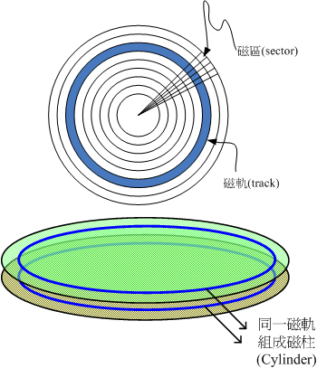

title: Linux学习环境搭建
date: 2016-05-15 10:56:35
tags: linux
---

## 需要准备的软件包
>1.	虚拟机软件VMware Workstation<!-- more -->
    win7系统推荐8.0版本，注意该软件并不是免费的。
    * 这里分享一个自己翻墙下的[VMware Workstation 8.0.3](http://pan.baidu.com/s/1i5xvYx3)
    * 需要输入的licence[0U6UU-6AJDL-RZTK9-230Q0-8ARJQ](http://www.56ads.com/article/1440.html)
>2.	linux系统镜像文件
	可以到[mirror.163.com](http://mirrors.163.com/)去下载，速度会比较快，最好用迅雷下载。

## 安装虚拟机需要注意的几点：
>1. 虚拟机网络配置
    * 桥接 可以简单理解为通过物理主机真实网卡连入实际的网络中。因此，虚拟机可以分配与物理主机相同网段的独立IP，所有网络功能和网络中的真实机器几乎完全一样。
    * NAT 虚拟机通过VMnet8虚拟网卡与外界通信。
    * Host-only 虚拟机通过VMnet1虚拟网卡与外界通信。与NAT的不同就是不能连internet网
    在后两种模式下，虚拟机的ip配置需要与虚拟网卡的VMnet1或者VMnet8的IP网段保持一致，配置完成后可以在windows端的命令窗口ping一下虚拟机ip看是否成功，验证完成后就能通过SecureCRT端远程管理Linux系统了。

## CentOS 6.X操作系统安装：
### 背景知识-硬盘与存储设备
   1. 硬盘的物理组成  硬盘其实是由许多的盘片、机械手臂、磁头与主轴马达所组成的。如下图所示：
   
   2. 盘片上的数据  
     __扇区Sector:__ 整个盘片上面好像有多个同心圆绘制出的饼图，而由圆心以放射状的方式分割出磁盘的最小存储单位，那就是扇区，在物理组成方面，每个扇区大小为512bytes，这个值是不会改变的。
     __磁道Track:__ 扇区组成一个圆就成为磁道。
     __柱面Cylinder:__ 多个盘片时，在所有盘片上面的同一个磁道可以组成一个柱面，柱面也是我们分割硬盘时的最小单位了。
   
   3. 计算整个硬盘的存储量时，计算公式就是：
   header磁头数量x每个header负责的柱面数量x每个柱面所含有的扇区数量x扇区容量
   4. 传输接口，硬盘与主机系统的连接主要有IDE接口和SATA接口
     __IDE接口:__  IDE介面插槽所使用的排线较宽，每条排线上面可以接两个IDE装置，由於可以接两个装置，那为了判别两个装置的主/从架构， 因此这种磁碟机上面需要调整跳针(Jump)成为Master或slave才行！
     __SATA接口:__ 由於SATA一条排线仅接一颗硬盘，所以你不需要调整跳针。不过一张主机板上面SATA插槽的数量并不是固定的， 且每个插槽都有编号，在连接SATA硬盘与主机板的时候，还是需要留意一下。
    

### 磁盘分区
   1. 创建第一个分区，/boot分区
   2. 创建swap交换分区
   3. 创建/(根)分区
   一般接下来还会创建/usr和/home分区

