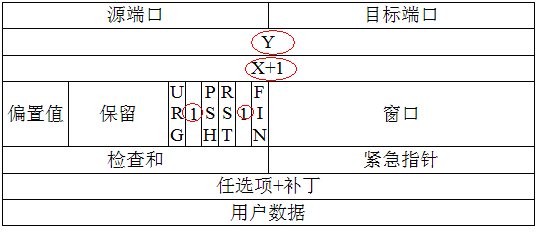
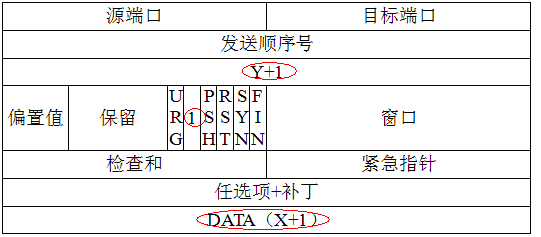

title: TCP/IP
date: 2016-05-13 07:00:00
tags: [network]
author: zhangleigang
category: network
---

## 首先我们来看TCP报文格式图

上图中有几个字段需要重点介绍下:
>1.序号：Seq序号，占32位，用来标识从TCP源端向目的端发送的字节流，发起方发送数据时对此进行标记。
>2.确认序号：Ack序号，占32位，只有ACK标志位为1时，确认序号字段才有效，Ack=Seq+1。
>3.标志位：共6个，即URG、ACK、PSH、RST、SYN、FIN等，具体含义如下：
（A）URG：紧急指针（urgent pointer）有效。(urgent紧急)
（B）ACK：确认序号有效。(acknowledgement 确认)
（C）PSH：接收方应该尽快将这个报文交给应用层。(push传送)
（D）RST：重置连接。(reset重置)
（E）SYN：发起一个新连接。(synchronous建立联机)
（F）FIN：释放一个连接。(finish结束)

### 需要注意的是：
（A）不要将确认序号Ack与标志位中的ACK搞混了。
（B）确认方Ack=发起方Req+1，两端配对。

## 我们在来看三次握手的过程，先上张图，然后对着图文字解释

>1.第一次握手：Client将标志位SYN置为1，随机产生一个值seq为X，并将该数据包发送给Server，Client进入SYN_SENT状态，等待Server确认。

>2.第二次握手：Server收到数据包后由标志位SYN=1知道Client请求建立连接，Server将标志位SYN和ACK都置为1，确认序号ack=X+1，随机产生一个值seq序号Y，并将该数据包发送给Client以确认连接请求，Server进入SYN_RCVD状态。

>3.第三次握手：Client收到确认后，检查ack是否为Y+1，ACK是否为1，如果正确则将标志位ACK置为1，ack=Y+1，并将该数据包发送给Server，Server检查ack是否为Y+1，ACK是否为1，如果正确则连接建立成功，Client和Server进入ESTABLISHED状态，完成三次握手，随后Client与Server之间可以开始传输数据了。

 
 针对以上几点需要补充一下,每次发送数据包时，发送的数据包都有seq号，接收端收到数据后，会回复ack进行确认，表示某一seq号数据已经收到。发送方在发送了某个seq包后，等待一段时间，如果没有收到对应的ack回复，就会认为报文丢失，会重传这个数据包。

 我们来小小总结下：首先是客户端发送SYN标志为1，和seq序号为x的数据包，此时客户端进入SYN_SEND状态，服务端接收后，看到SYN标志为1，知道要建立连接，所以置SYN和ACK标志位为1，然后确认ack号为x+1,还会发送一个seq号为y的序列号，此时服务器进入SYN_RECV状态，客户端这边又接收到了，数据包的ACK标志为1，回复的确认ack为x+1,那我也跟你确认一下，也就会发一ACK标志为1和确认ack号为y+1的数据包，此包发送完毕，客户端和服务器进入ESTABLISHED状态，这时候连接就建立起来了。

## 为什么不能只两次握手？
  假设：如果发送网络阻塞，由于TCP/IP协议定时重传机制，B向A发送了两次SYN请求，分别是x1和x2，且因为阻塞原因，导致x1连接请求和x2连接请求的TCP窗口大小和数据报文长度不一致，如果最终x1达到A，x2丢失，此时A同B建立了x1的连接，这个时候，因为AB已经连接，B无法知道是请求x1还是请求x2同B连接，如果B默认是最近的请求x2同A建立了连接，此时B开始向A发送数据，数据报文长度为x2定义的长度，窗口大小为x2定义的大小，而A建立的连接是x1，其数据包长度大小为x1，TCP窗口大小为x1定义，这就会导致A处理数据时出错。

   很显然，如果A接收到B的请求后，A向B发送SYN请求y3（y3的窗口大小和数据报长度等信息为x1所定义），确认了连接建立的窗口大小和数据报长度为x1所定义，A再次确认回答建立x1连接，然后开始相互传送数据，那么就不会导致数据处理出错了。

## 四次挥手的解释
   TCP连接时全双工的，因此，每个方向都必须要单独进行关闭，这一原则是当一方完成数据发送任务后，发送一个FIN来终止这一方向的连接，收到一个FIN只是意味着这一方向上没有数据流动了，即不会再收到数据了，但是在这个TCP连接上仍然能够发送数据，直到这一方向也发送了FIN。

## 为什么连接的时候是三次握手，关闭的时候却是四次握手？
   这是因为服务端的LISTEN状态下的SOCKET当收到SYN报文的建连请求后，它可以把ACK和SYN（ACK起应答作用，而SYN起同步作用）放在一个报文里来发送。但关闭连接时，当收到对方的FIN报文通知时，它仅仅表示对方没有数据发送给你了；但未必你所有的数据都全部发送给对方了，所以你不可以马上关闭SOCKET,也即你可能还需要发送一些数据给对方之后，再发送FIN报文给对方来表示你同意现在可以关闭连接了，所以它这里的ACK报文和FIN报文多数情况下都是分开发送的。